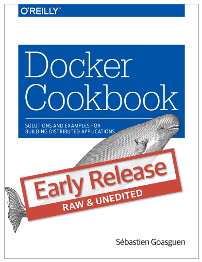

[Docker](http://docker.com) cookbook examples

This repository is a collection of scripts/Vagrantfiles for the O'Reilly Docker [cookbook](http://shop.oreilly.com/product/0636920036791.do)

* * *
*The book is now finished, however due to frequent changes of Docker they may need to be updated*
* * *

Chapters
========

[Chapter 1 - Installation](ch01/)

[Chapter 2 - Image Creation and Sharing](ch02/)

[Chapter 3 - Networking](ch03/)

[Chapter 4 - Configuration and Dev](ch04/)

[Chapter 5 - Kubernetes](ch05/)

[Chapter 6 - Optimized OS for Docker](ch06/)

[Chapter 7 - Tools ](ch07/)

[Chapter 8 - Docker in the Cloud](ch08/)

[Chapter 9 - Monitoring and Logging](ch09/)

[Chapter 10 - Use cases](ch10/)

Issues and Contributing
=======================

If you have any issues with these scripts, please create an [issue](https://github.com/how2dock/docbook/issues) or submit a [pull request](https://github.com/how2dock/docbook/pulls).

